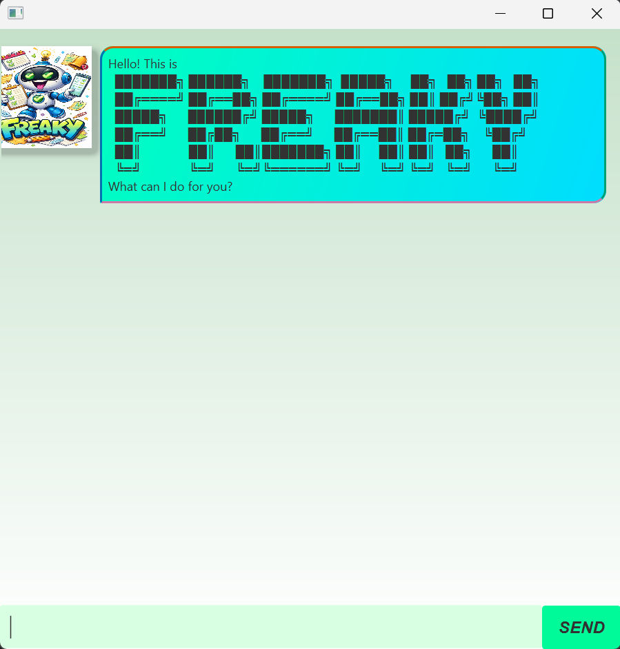

# Freaky User Guide



Freaky is a desktop task management chatbot built using Java and JavaFX.
It helps users manage tasks efficiently through a conversational interface.

---

## Getting Started

Ensure you have Java 17 or later installed.

1. Download freaky.jar.

2. Run:
    ```
    java -jar freaky.jar
    ```
   
3. Start typing commands into the input box!

---

## Feature 1: Adding a To-Do Task

Adds a simple task without date or time.

Format:
```
todo <description>
```

Example:
```
todo Chat with Freaky
```

Expected Output:
```
Got it. Freaky has added this task:
[T][ ] Chat with Freaky
Now you have 1 task in the list.
```

---

## Feature 2: ⏰ Adding a Deadline Task

Adds a task that must be completed before a specific date/time.

Format:
```
deadline <description> /by <date>
```

Example:
```
deadline Buy Freaky Premium /by 2026-02-01 0000
```

Expected Output:
```
Got it. Freaky has added this task:
[D][ ] Buy Freaky Premium (by: Feb 1 2026 00:00)
Now you have 2 tasks in the list.
```

---

## Feature 3: 📅 Adding an Event Task

Adds a task that happens during a time period.

Format:
```
event <description> /from <start> /to <end>
```

Example:
```
event Chat with Freaky /from 2026-02-01 0000 /to 3026-02-01 0000
```

Expected Output:
```
Got it. Freaky has added this task:
[E][ ] Chat with Freaky (from: Feb 1 2026 00:00 to: Feb 1 3026 00:00)
Now you have 3 tasks in the list.
```

---

## Feature 4: 📒 Listing All Tasks

Displays all current tasks.

Format:
```
list
```

Expected Output:
```
Here are the tasks in your list:
1. [T][ ] Chat with Freaky
2. [D][ ] Buy Freaky Premium (by: Feb 1 2026 00:00)
3. [E][ ] Chat with Freaky (from: Feb 1 2026 00:00 to: Feb 1 3026 00:00)
```

---

## Feature 5: ✅ Marking a Task as Done

Marks a task as completed.

Format:
```
mark <task number>
```

Example:
```
mark 2
```

Expected Output:
```
Nice! Freaky has marked this task as done:
[D][X] Buy Freaky Premium (by: Feb 1 2026 00:00)
```

---

## Feature 6: ❌ Unmarking a Task to Undone

Unmarks a task as not completed.

Format:
```
unmark <task number>
```

Example:
```
unmark 2
```

Expected Output:
```
Oh no. Freaky has marked this task as not done yet:
[D][ ] Buy Freaky Premium (by: Feb 1 2026 00:00)
```

---

## Feature 8: 🗑 Deleting a Task

Removes a task from the list.

Format:
```
delete <task number>
```

Example:
```
delete 1
```

Expected Output:
```
Noted. Freaky has removed this task:
[T][ ] Chat with Freaky
Now you have 2 tasks in the list.
```

---

## Feature 9: 📋 Checking a Task

Checks the upcoming deadlines and events. Supports multiple input formats.

Format:
```
check
check <number>
check deadline
check event
check deadline <number>
check event <number>
```

Description:
- check – Shows 1 closest deadline and 1 closest event.
- check n – Shows the n closest deadlines and events.
- check deadline – Shows 3 closest deadlines.
- check event – Shows 3 closest events.
- check deadline n – Shows the n closest deadlines.
- check event n – Shows the n closest events.

Examples:

- Example 1 – Default check
    ```
    check
    ```
  
    Expected output:
    ```
    Checking the incoming 1 deadlines in your list...
    Here are the incoming 1 deadlines in your list:
    1. [D][ ] Buy Freaky Premium (by: Feb 1 2026 00:00)
  
    Checking the incoming 1 events in your list...
    Here are the incoming 1 events in your list:
    1. [E][ ] Chat with Freaky (from: Feb 1 2026 00:00 to: Feb 1 3026 00:00)
    ```

- Example 2 – Check 2 deadlines
    ```
    check deadline 2
    ```

    Expected output:
    ```
    Checking the incoming 2 deadlines in your list...
    Good news! There is only 1 deadlines left in your list. Congrats!
    Here are the incoming 1 deadlines in your list:
    1. [D][ ] Buy Freaky Premium (by: Feb 1 2026 00:00)
    ```

---

## Feature 10: 🔍 Finding a Task

Finds tasks that contain a specific keyword in their description.

Format:
```
find <keyword>
```

Examples:

- Example 1 – Keyword found

```
find Freaky
```

Expected output:
```
Here are the matching tasks in your list for keyword: 'Freaky'
1. [D][ ] Buy Freaky Premium (by: Feb 1 2026 00:00)
2. [E][ ] Chat with Freaky (from: Feb 1 2026 00:00 to: Feb 1 3026 00:00)
```

- Example 2 – Keyword not found

```
find Duke
```

Expected output:
```
Oh no Freaky can't find tasks that matches your keyword: Duke
```

## ⚠️ Error Handling

Freaky performs input validation and shows helpful error messages when:
- Task number is negative
- Task number exceeds list size
- Command format is invalid
- Required arguments are missing

Example:
```
mark -1
```

Output:
```
Broooo how is it possible? A non positive number? (◣_◢)
```

---

## 🖥️ Graphical User Interface

Freaky includes:
- Scrollable chat window
- Auto-resizing message bubbles
- Window minimum size: 650 × 650
- Resizable chat window
- Profile images for user and chatbot

---

## 🧠 Command Summary
- ```todo```        Add a simple task
- ```deadline```	Add a task with deadline
- ```event```	    Add a task with time range
- ```list```	    Show all tasks
- ```mark```	    Mark task as done
- ```unmark```      Unmark a done task
- ```delete```    	Delete task
- ```check```       Check for the upcoming tasks
- ```find```        Find tasks through keyword

---

## 💡 Tips
- Task numbers start from 1 when using mark or delete.
- Avoid leaving out required keywords like /by, /from, /to.
- Ensure correct spacing between command parts.
